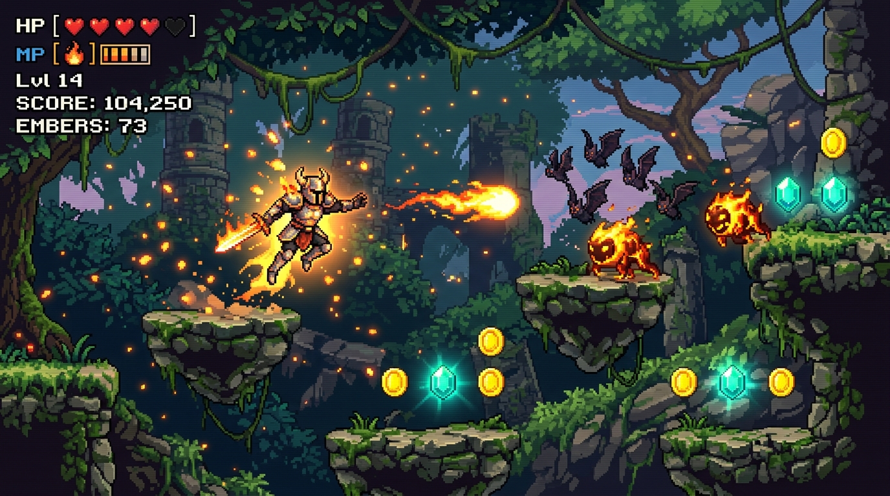

# 🔥 Ember Knight: Blazing Ascent

[](https://aakanx.github.io/Ember-Knight/)
[](https://aistudio.google.com/)
[](https://deepmind.google/technologies/gemini/)

> **Play online now at:** **[https://aakanx.github.io/Ember-Knight/](https://aakanx.github.io/Ember-Knight/)**

**Ember Knight: Blazing Ascent** is an arcade action platformer built for the modern web. Master the ancient flame, leap across treacherous platforms, disintegrate enemies with fireballs, and liberate the Pyros realm from the ancient Wyrm of Embers.

---

## 🎮 Gameplay Preview



---

## ✨ Features

- **Dynamic Combat & Mobility**:
  - Double jump, drop through one-way ledges, and super-bounce on spring mushrooms.
  - Quick-cast flame projectiles or hold to charge a screen-clearing **Mega Inferno Blast**.
  - **Flame Dash (`SHIFT`)** granting brief invulnerability through traps and boss projectiles.
- **Three Handcrafted Chapters**:
  - **Chapter I: The Whispering Canopy** — Forest ruins, bouncing shrooms, and cracked secrets.
  - **Chapter II: Molten Caverns** — Vertical elevators, lava geysers, and flame-spitting guardians.
  - **Chapter III: The Obsidian Citadel** — Confront the colossal, multi-phase **Wyrm of Embers**.
- **Collectibles & Mastery**:
  - 3 hidden Ember Gems per chapter, secret alcoves, and gold coins.
  - Per-chapter mastery tracking and realm completion rating.
- **Procedural Web Audio Soundtrack**:
  - Dynamic chiptune music synthesized in real-time via the Web Audio API—zero external audio files or bandwidth lag.
  - **Ember Sound Vault**: A mastery reward allowing you to synthesize and export the boss theme directly as a 16-bit stereo CD-quality `.WAV` file.

---

## ⌨️ Controls

| Action | Primary Key | Secondary / Alternative |
| :--- | :--- | :--- |
| **Move Left / Right** | `←` / `→` | `A` / `D` |
| **Jump & Double Jump** | `↑` | `W` / `Space` |
| **Drop Down Platform** | `↓` | `S` |
| **Cast Fireball / Mega Blast** | `Space` *(Tap / Hold)* | `J` |
| **Flame Dash (Invulnerable)** | `Shift` | `K` |
| **Pause / Resume** | `Esc` | `P` |

---

## ⚡ Built with Google AI Studio & Gemini 3.8 Flash

This project was built as an experimental **vibe coding** project using **[Google AI Studio](https://aistudio.google.com/)** and **Gemini 3.8 Flash**.

From the custom 60 FPS HTML5 canvas platformer physics engine, collision detection, and multi-layered parallax backgrounds, to real-time Web Audio API chiptune sound synthesis and offline WAV rendering—the entire game experience was designed, iterated, and polished collaboratively through natural language prompts.

---

## 🛠️ Local Development

Clone the repository and run the dev server locally:

```bash
# 1. Clone the repo
git clone https://github.com/aakanx/Ember-Knight.git
cd Ember-Knight

# 2. Install dependencies
npm install --legacy-peer-deps

# 3. Start local development server
npm run dev
```

Visit `http://localhost:3000` to play locally.

### Production Build

```bash
npm run build
```

The bundled static assets will be output to `/dist`, ready to deploy on GitHub Pages or any static host.

---

## 📜 License

Created with flame and code. Feel free to fork, customize, and build your own chapters!
